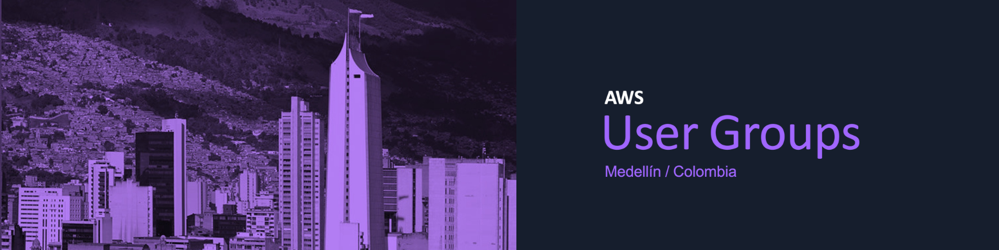
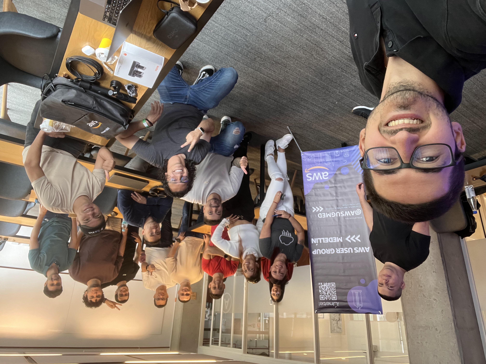
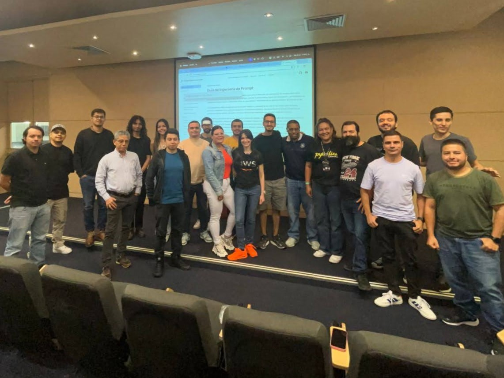

# AWS User Group Medellín, Colombia! ☁️

  

Welcome to the **AWS User Group Medellín** official GitHub organization! We’re a community of AWS enthusiasts, builders, and cloud explorers based in the vibrant city of Medellín, Colombia. Our mission is to connect, learn, and share everything AWS with everyone in the region and beyond! 🌍🚀

- **Meetup Page**: Stay up to date on our events and join our sessions: [AWS User Group Medellín](https://www.meetup.com/awsugmed/)
- **Linktree**: Find all our social media and important links: [linktr.ee/awsugmed](https://linktr.ee/awsugmed)

## Event Photos! 🫂

## 🛠️ Admins & Maintainers

Our team of dedicated AWS Enthusiasts keeps this organization organized and thriving! For any questions, reach out to us:

- **Alejandro Mendoza** - [amendozafor](https://github.com/amendozafor)
- **Anderson Londoño** - [londoso](https://github.com/londoso)
- **David Arias** - [devarias](https://github.com/devarias)
- **Lorena Jimenez** - [lorejimenez117](https://github.com/lorejimenez117)
- **Santiago Garcia Arango** - [san99tiago](https://github.com/san99tiago)

---

Let’s build, learn, and grow our AWS knowledge together! 💻☁️
